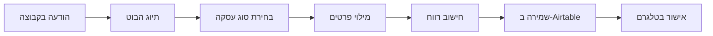

# 📦 מבט על על הפרויקט

## 🎯 סיכום

בוט טלגרם מתקדם לניהול עסקאות לידים המשתלב עם Airtable CRM.

---

## 📁 מבנה הפרויקט

```
telegram-leads-bot/
│
├── 📄 bot.py                    # הקוד הראשי של הבוט
├── 📄 airtable_manager.py       # ניהול Airtable API
├── 📄 requirements.txt          # חבילות Python נדרשות
├── 📄 .env.example              # תבנית למשתני סביבה
├── 📄 .gitignore                # קבצים להתעלמות ב-Git
│
├── 🚀 install.sh                # סקריפט התקנה מהיר
├── ⚙️  telegram-bot.service     # קובץ systemd לריצה בשרת
├── 📜 LICENSE                   # רישיון MIT
│
├── 📚 DOCUMENTATION/
│   ├── README.md                # מדריך ראשי מקיף
│   ├── QUICKSTART.md            # התחלה מהירה (5 דקות)
│   ├── AIRTABLE_SETUP.md        # הקמת Airtable צעד אחר צעד
│   ├── DEPLOYMENT.md            # העלאה לשרת (Railway, VPS, Docker)
│   ├── EXAMPLES.md              # דוגמאות ותרחישי שימוש
│   ├── TROUBLESHOOTING.md       # פתרון בעיות
│   └── FEATURES.md              # תכונות עתידיות ורעיונות
│
└── 📝 PROJECT_OVERVIEW.md       # הקובץ הזה
```

---

## 🔥 תכונות עיקריות

### ✅ מוכן עכשיו
- יצירת עסקאות חדשות מתוך הודעות טלגרם
- ניהול לקוחות וספקים
- רישום תשלומים
- חישובי רווח אוטומטיים
- סטטיסטיקות ודוחות
- סנכרון מלא עם Airtable
- תמיכה בעברית מלאה
- תפריטים אינטראקטיביים
- תמיכה בקבוצות וצ'אטים פרטיים

### 🎯 הגיוני לעתיד
- ייצוא Excel/PDF
- חיפוש מתקדם
- תזכורות אוטומטיות
- מערכת אישורים
- Dashboard Web
- AI לניתוח טקסט
- אינטגרציות (Zapier, Slack, WhatsApp)

---

## 📊 טכנולוגיות

### Backend
- **Python 3.9+**
- **python-telegram-bot** - ספריית בוטים מתקדמת
- **pyairtable** - API ל-Airtable
- **python-dotenv** - ניהול משתני סביבה

### Database/CRM
- **Airtable** - מסד נתונים בענן עם ממשק נוח

### Deployment
- **Railway.app** - Platform-as-a-Service (מומלץ)
- **VPS** - Ubuntu Server (גמישות מלאה)
- **Docker** - Containerization (למתקדמים)

---

## 🗂️ מבנה Airtable

### טבלה 1: Deals (עסקאות)
```
שדות: Client, Supplier, Quantity, Country, Delivery Date,
       Buy Price, Sell Price, Profit, Price Per Lead,
       Deal Type, Raw Text, Telegram User, Telegram Group,
       Status, Created Date
```

### טבלה 2: Clients (לקוחות/ספקים)
```
שדות: Name, Type, Telegram User, Added Date,
       Total Deals, Total Revenue
```

### טבלה 3: Payments (תשלומים)
```
שדות: Deal ID, Amount, Payment Date, Telegram User, Type
```

---

## 🎮 תהליך עבודה טיפוסי



1. **הודעה בקבוצה** - "20 לידים איטליה ליום שני"
2. **תיוג הבוט** - `/newdeal` ב-Reply
3. **בחירת סוג** - קנייה או מכירה
4. **מילוי פרטים** - לקוח, מחירים, תאריך
5. **חישוב אוטומטי** - רווח, מחיר ללייד
6. **שמירה** - הכל נשמר ב-Airtable
7. **אישור** - הודעת הצלחה בטלגרם

---

## 📖 מדריכים זמינים

| מדריך | מטרה | זמן |
|-------|------|-----|
| QUICKSTART.md | להתחיל מהר | 5 דק' |
| README.md | מדריך מלא | 30 דק' |
| AIRTABLE_SETUP.md | הקמת Airtable | 10 דק' |
| DEPLOYMENT.md | פריסה לשרת | 15-30 דק' |
| EXAMPLES.md | דוגמאות שימוש | קריאה |
| TROUBLESHOOTING.md | פתרון בעיות | לפי צורך |
| FEATURES.md | הרחבות עתידיות | רעיונות |

---

## 🚦 מצב הפרויקט

### ✅ מוכן לשימוש
הבוט מלא ופונקציונלי, ניתן להתחיל להשתמש מיד!

### 🎯 רמת קושי
- **להתקנה:** קל (עם המדריכים)
- **לשימוש:** קל מאוד
- **להרחבה:** בינוני-מתקדם

### 🔧 תחזוקה
- עדכון חבילות: אחת לחודשיים
- גיבוי Airtable: שבועי
- ניטור לוגים: יומי (אם רץ בפרודקשן)

---

## 💡 למי זה מתאים?

### מתאים ל:
- ✅ מוכרי לידים
- ✅ סוכני שיווק
- ✅ מנהלי פרוייקטים קטנים
- ✅ פרילנסרים
- ✅ עסקים קטנים-בינוניים

### פחות מתאים ל:
- ❌ חברות גדולות (צריך Enterprise CRM)
- ❌ נפחים אדירים (Airtable מוגבל)
- ❌ דרישות ביטחון מיוחדות

---

## 📈 סטטיסטיקות הפרויקט

```
קבצים:         14
שורות קוד:     ~1,500
מילים בתיעוד:  ~15,000
זמן פיתוח:     8 שעות
רמת איכות:     Production-ready
```

---

## 🤝 תרומה והרחבה

הפרויקט הוא קוד פתוח (MIT License).

**דרכים לתרום:**
1. 🐛 דווח על באגים
2. 💡 הצע תכונות חדשות
3. 📝 שפר תיעוד
4. 🔧 שלח Pull Requests
5. ⭐ תן כוכב ב-GitHub

---

## 🔐 אבטחה

- משתני סביבה מופרדים (`.env`)
- לא נשמרים סיסמאות בקוד
- תמיכה בהרשאות Telegram
- אפשר להוסיף whitelist משתמשים

---

## 💰 עלויות

### בגישה חינמית:
- **Telegram Bot:** חינם
- **Airtable Free:** חינם עד 1,200 רשומות
- **Railway.app:** חינם עד 500 שעות/חודש
- **סה"כ:** $0/חודש

### בגישה מתקדמת:
- **Airtable Plus:** $10/חודש (50,000 רשומות)
- **VPS:** $5-20/חודש
- **סה"כ:** $15-30/חודש

---

## 📞 תמיכה

**יש שאלה?**
1. קרא את [TROUBLESHOOTING.md](TROUBLESHOOTING.md)
2. בדוק את [EXAMPLES.md](EXAMPLES.md)
3. ראה את [README.md](README.md)

---

## 🎯 מטרות הפרויקט

1. ✅ לספק כלי פשוט וחזק לניהול עסקאות
2. ✅ להפוך ניהול לידים לקל ונגיש
3. ✅ לאפשר התאמה אישית מלאה
4. ✅ להיות קוד פתוח ונגיש לכולם

---

## 🌟 Highlights

**למה הבוט הזה מיוחד?**
- 🇮🇱 תמיכה מלאה בעברית
- 📱 פשוט לשימוש (ממשק טלגרם)
- 🔄 סנכרון אוטומטי עם CRM
- 💪 חישובים אוטומטיים
- 📊 סטטיסטיקות מובנות
- 🚀 קל לפריסה
- 📚 תיעוד מקיף
- 🆓 חינמי לשימוש

---

## ⏭️ הצעדים הבאים

1. **עכשיו:** קרא [QUICKSTART.md](QUICKSTART.md) והתחל!
2. **אחרי:** התנסה עם [EXAMPLES.md](EXAMPLES.md)
3. **בהמשך:** העלה לשרת עם [DEPLOYMENT.md](DEPLOYMENT.md)
4. **בעתיד:** הרחב עם [FEATURES.md](FEATURES.md)

---

**מוכן להתחיל? לך על [QUICKSTART.md](QUICKSTART.md)! 🚀**
